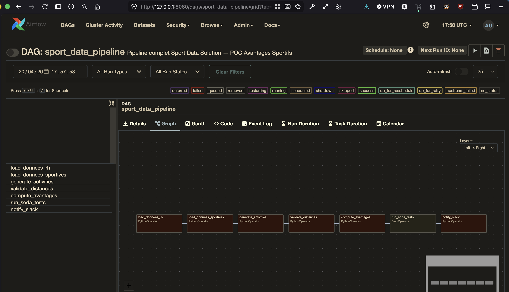
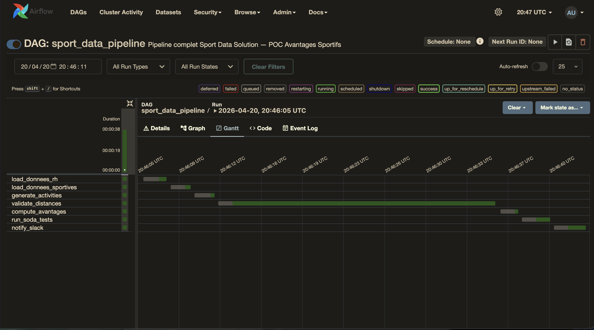
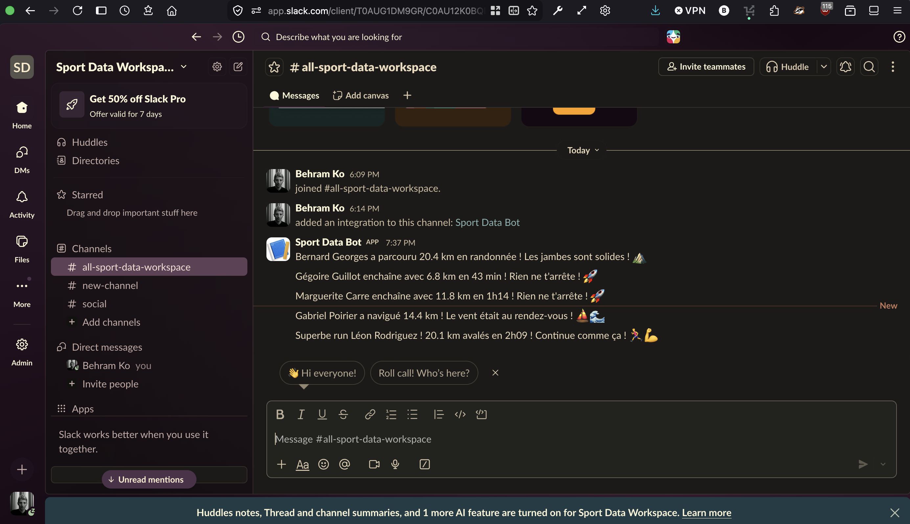
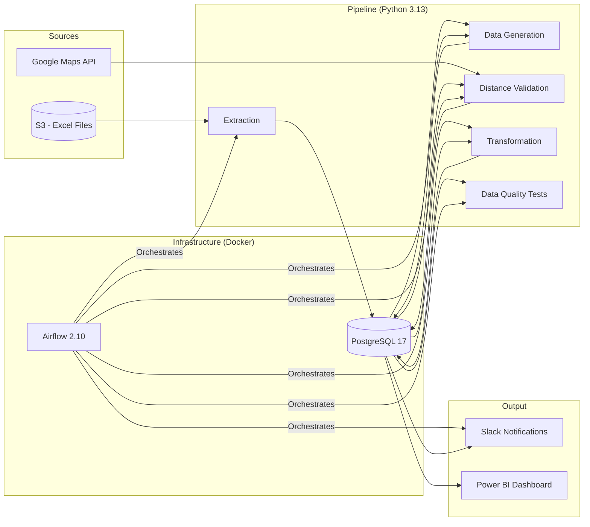
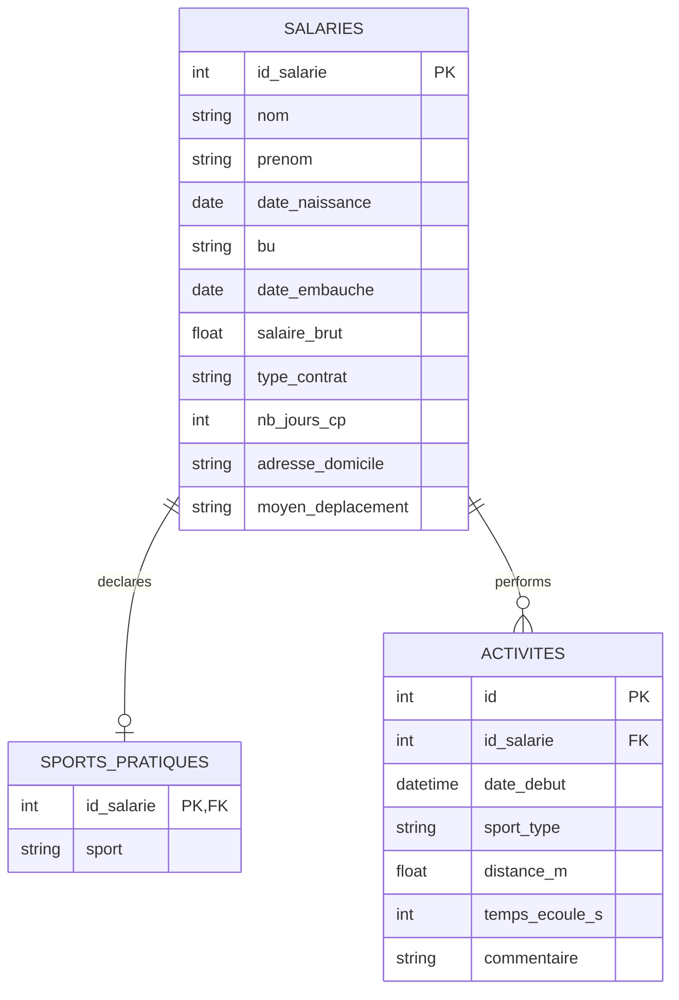

[](https://github.com/behramkorkut/sport-data-solution/actions/workflows/ci.yml)
# 🏅 Sport Data Solution — Sports Benefits POC

[](https://www.python.org/)
[](https://www.postgresql.org/)
[](https://airflow.apache.org/)
[](https://www.docker.com/)
[](https://www.soda.io/)

## Overview

This project is a **Proof of Concept (POC)** built for **Sport Data Solution**, a startup focused on sports performance monitoring. The goal is to evaluate the feasibility of a **sports benefits program** for employees, including:

- **Sports Commute Bonus**: 5% of gross annual salary for employees commuting to the office via physical activity (cycling, walking, running, scooter, etc.)
- **5 Wellness Days**: granted to employees who log at least 15 physical activities per year

The project implements a full end-to-end data pipeline: extraction from external sources, transformation, database loading, synthetic data generation, distance validation, data quality testing, Slack notifications, and Power BI reporting.


---

## 🖥️ Demo

### Airflow DAG — Graph View



### Airflow DAG — Gantt View (Pipeline Execution)



### Slack Notifications



## Architecture

The diagram below shows the end-to-end flow across data sources, pipeline components, infrastructure, and outputs.



## DAG Pipeline

The Airflow DAG orchestrates the pipeline through the following task sequence.


## Data Model

The core entities and relationships used in the POC are represented below.



## Tech Stack

| Component        | Technology                  | Version | Purpose                                       |
| ---------------- | --------------------------- | ------: | --------------------------------------------- |
| Language         | Python                      |    3.13 | ETL scripts, data generation, transformations |
| Database         | PostgreSQL                  |      17 | Persistent data storage                       |
| Orchestration    | Apache Airflow              |  2.10.5 | Pipeline automation & monitoring              |
| Containerization | Docker Compose              |       - | Reproducible infrastructure                   |
| Data Quality     | Soda Core                   |   3.5.6 | Automated data validation (20 checks)         |
| Distance API     | Google Maps Distance Matrix |       - | Home-to-office distance validation            |
| Notifications    | Slack Incoming Webhook      |       - | Real-time activity notifications              |
| Visualization    | Power BI                    |       - | KPI dashboard for stakeholders                |
| Package Manager  | uv (Astral)                 |    0.10 | Fast Python dependency management             |
| ORM              | SQLAlchemy                  |     2.0 | Database models & queries                     |

## Project Structure

```text
sport-data-solution/
├── dags/
│   └── sport_pipeline_dag.py        # Airflow DAG — pipeline orchestration
├── data/
│   ├── raw/                         # Raw source data (Excel files)
│   └── processed/                   # Transformed outputs (CSV)
├── src/
│   ├── extraction/
│   │   ├── load_rh.py               # HR data extraction (S3 + local fallback)
│   │   └── load_sports.py           # Sports data extraction (S3 + local fallback)
│   ├── transformation/
│   │   ├── validate_distances.py    # Google Maps distance validation
│   │   └── compute_avantages.py     # Benefits eligibility & financial impact
│   ├── generation/
│   │   └── generate_activities.py   # Synthetic Strava-like activity generation
│   ├── notifications/
│   │   └── slack_notifier.py        # Slack message dispatcher
│   └── utils/
│       ├── database.py              # PostgreSQL connection (SQLAlchemy 1.4/2.0)
│       ├── models.py                # ORM table definitions
│       ├── init_db.py               # Database initialization
│       └── export_powerbi.py        # CSV export for Power BI
├── tests/
│   └── soda/
│       ├── configuration.yml        # Soda Core datasource config
│       └── checks.yml               # 20 data quality checks
├── dashboards/                      # Exported CSV files for Power BI
├── docker-compose.yml               # PostgreSQL 17 + Airflow 2.10
├── pyproject.toml                   # Python dependencies (uv)
├── .env                             # Environment variables (not versioned)
└── README.md
```

## Getting Started

**Prerequisites**

- macOS / Linux
- Docker & Docker Compose
- Python 3.13+
- uv — Python package manager
- Google Cloud account — Distance Matrix API key
- Slack workspace — Incoming Webhook URL

1. **Clone the repository**
   
   ```bash
   git clone https://github.com/your-username/sport-data-solution.git
   cd sport-data-solution
   ```
2. **Configure environment variables**
   
   ```env
   POSTGRES_USER=sport_admin
   POSTGRES_PASSWORD=sport_secret_2026
   POSTGRES_DB=sport_data
   POSTGRES_PORT=5432
   GOOGLE_MAPS_API_KEY=your_google_maps_api_key
   SLACK_WEBHOOK_URL=https://hooks.slack.com/services/XXX/XXX/XXX
   ```
3. **Install Python dependencies**
   
   ```bash
   uv sync
   ```
4. **Start the Docker infrastructure**
   
   ```bash
   docker compose up -d
   ```
5. **Initialize the database and run the pipeline manually**
   
   ```bash
   # Create tables
   uv run python -m src.utils.init_db
   
   # Load source data
   uv run python -m src.extraction.load_rh
   uv run python -m src.extraction.load_sports
   
   # Generate synthetic activities (12 months, ~2000 records)
   uv run python -m src.generation.generate_activities
   
   # Validate commute distances via Google Maps
   uv run python -m src.transformation.validate_distances
   
   # Compute benefits eligibility
   uv run python -m src.transformation.compute_avantages
   
   # Run data quality tests
   uv run soda scan -d sport_data -c tests/soda/configuration.yml tests/soda/checks.yml
   
   # Send Slack notifications (last 5 activities)
   uv run python -m src.notifications.slack_notifier
   
   # Export data for Power BI
   uv run python -m src.utils.export_powerbi
   ```
6. **Run the full pipeline via Airflow**
   
   - Open http://localhost:8080 (credentials: admin / admin)
   - Enable the `sport_data_pipeline` DAG
   - Click **Trigger DAG** to run the full pipeline

## Data Quality Tests

20 automated checks across 4 tables, powered by Soda Core.

| Table                | Check                          | Status    |
| -------------------- | ------------------------------ | --------- |
| salaries             | Table is not empty             | ✅ PASSED |
| salaries             | Unique employee IDs            | ✅ PASSED |
| salaries             | No missing last names          | ✅ PASSED |
| salaries             | No missing first names         | ✅ PASSED |
| salaries             | No missing salaries            | ✅ PASSED |
| salaries             | No missing commute mode        | ✅ PASSED |
| salaries             | Salary is strictly positive    | ✅ PASSED |
| salaries             | Valid contract types (CDI/CDD) | ✅ PASSED |
| salaries             | Valid business units           | ✅ PASSED |
| sports_pratiques     | Table is not empty             | ✅ PASSED |
| sports_pratiques     | One sport per employee         | ✅ PASSED |
| activites            | More than 1000 records         | ✅ PASSED |
| activites            | Non-negative distances         | ✅ PASSED |
| activites            | Non-negative elapsed time      | ✅ PASSED |
| activites            | No missing employee IDs        | ✅ PASSED |
| activites            | No missing dates               | ✅ PASSED |
| activites            | No missing sport types         | ✅ PASSED |
| validation_distances | Table is not empty             | ✅ PASSED |
| validation_distances | All distances computed         | ✅ PASSED |
| validation_distances | Positive distances             | ✅ PASSED |

## POC Results

### Financial Impact

| Metric                               | Value          |
| ------------------------------------ | -------------- |
| Employees eligible for sports bonus  | 68 / 161 (42%) |
| Total bonus cost                     | €172,482.50   |
| Average bonus per employee           | €2,536.51     |
| Employees eligible for wellness days | 73 / 161 (45%) |
| Total wellness days granted          | 365 days       |

## Breakdown by Business Unit

| Business Unit | Employees | Bonus Eligible | Bonus Cost | Wellness Eligible | Wellness Days |
| ------------- | --------: | -------------: | ---------: | ----------------: | ------------: |
| Finance       |        42 |             23 |   €59,439 |                22 |           110 |
| Support       |        35 |             15 |   €42,043 |                14 |            70 |
| Sales         |        33 |             15 |   €36,697 |                17 |            85 |
| Marketing     |        25 |             10 |   €24,530 |                10 |            50 |
| R&D           |        26 |              5 |    €9,774 |                10 |            50 |

## Distance Validation

- 68 employees with sports commute verified via Google Maps API
- 0 anomalies detected
- All distances compliant with thresholds (walking ≤ 15 km, cycling ≤ 25 km)

## Security & Best Practices

- Sensitive data: credentials and API keys stored in `.env` (excluded from version control via `.gitignore`)
- HR data protection: PostgreSQL access restricted by authentication
- Reproducibility: fully containerized infrastructure with Docker Compose
- Data quality: 20 automated checks on every pipeline run
- Traceability: full execution logs in Airflow for audit purposes

## Future Improvements

- Strava API integration: replace synthetic data with real employee activity feeds
- Scheduled execution: configure Airflow DAG for daily/weekly automated runs
- Email alerts: notify stakeholders on pipeline failures
- Enhanced dashboard: add temporal filters and drill-down capabilities in Power BI
- Airflow 3.x migration: leverage native SQLAlchemy 2.x support
- CI/CD: add GitHub Actions for automated testing on push

## License

This project was developed as part of the Data Engineer certification program (Project 12).
