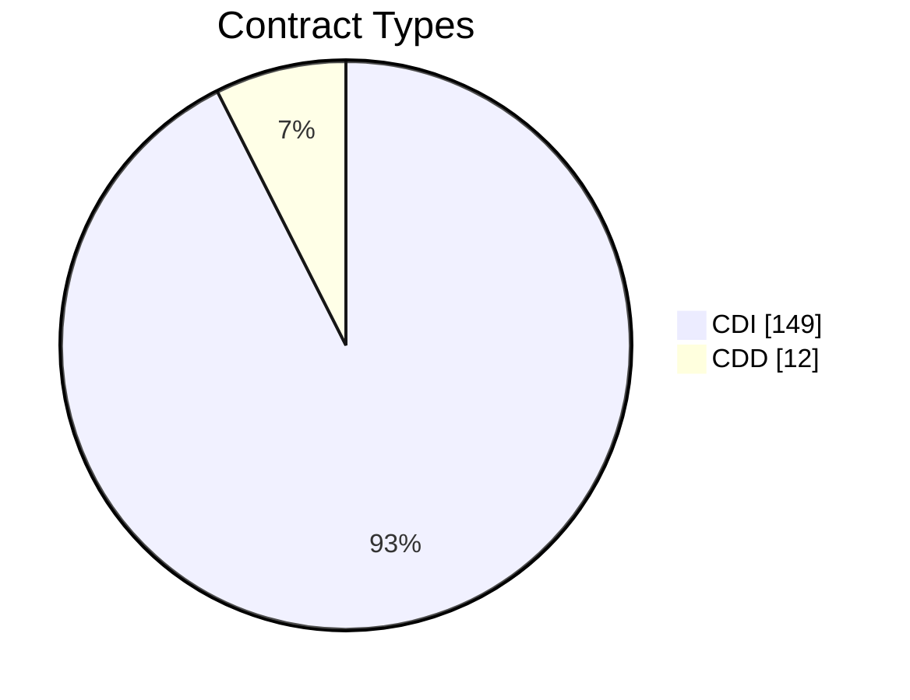
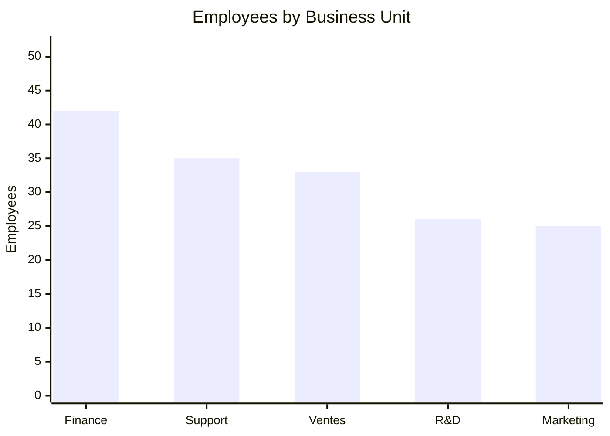
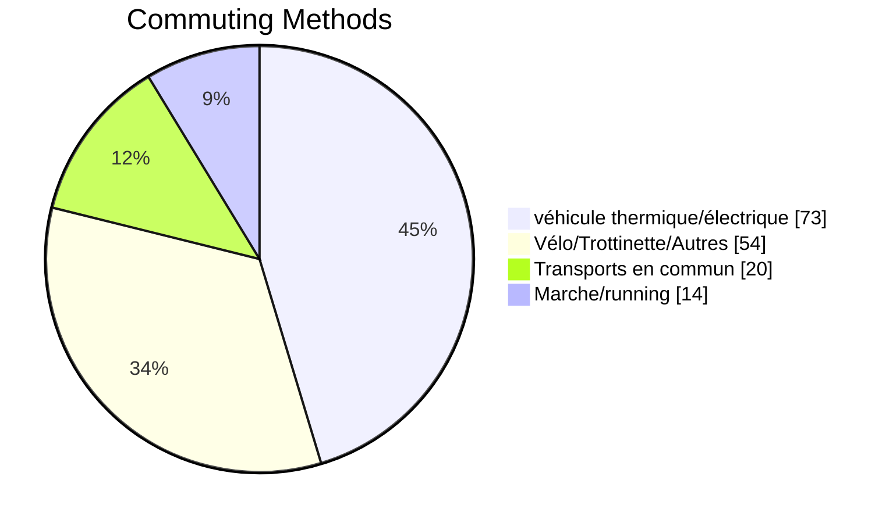
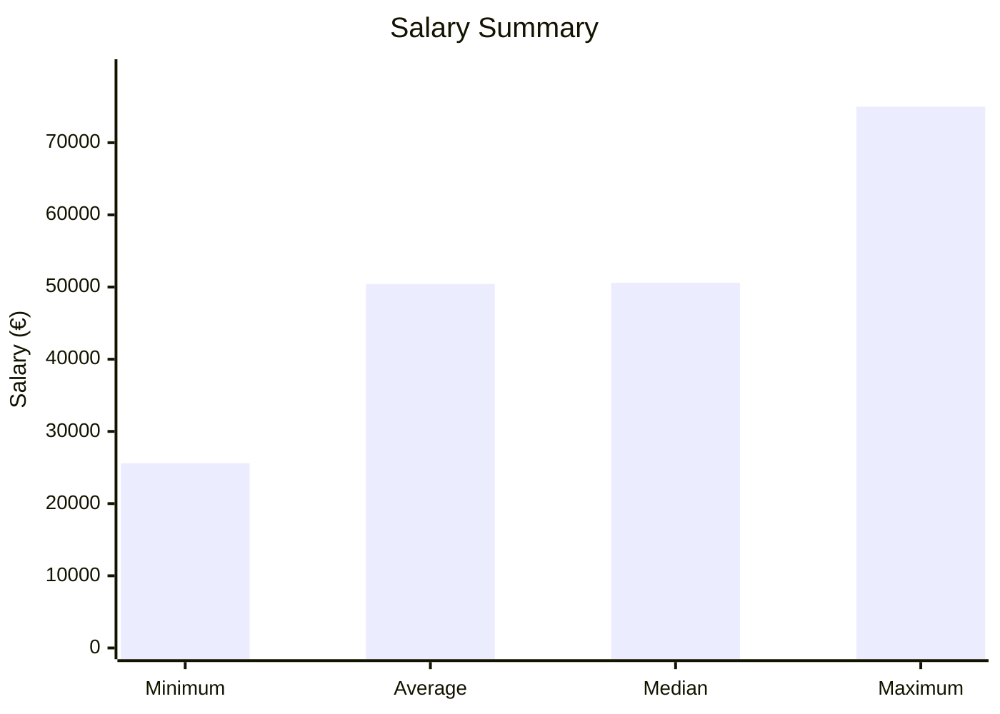

# 📊 HR Data Analysis Report

## Executive Summary

This report analyzes HR data for **161 employees** and highlights the most relevant insights on compensation, contract structure, business-unit distribution, and commuting habits.  
The goal is to provide a quick, visual, and professional overview that can be reused directly in documentation or presentations.

## Key Insights

1. **Compensation is relatively spread out**: salaries range from **€25,570** to **€74,990**, with an average of **€50,426.27**.
2. **The workforce is highly stable**: **149 employees** are on **CDI**, representing the overwhelming majority.
3. **Finance is the largest business unit** followed by **Support** and **Ventes**.
4. **Individual vehicle use dominates commuting**, but alternative mobility methods still represent a meaningful share.

---

## 1. Dataset Overview

| Metric | Value |
|---|---:|
| Total Employees | 161 |
| Columns | 11 |
| Average Salary | €50,426.27 |
| Median Salary | €50,580.00 |
| Minimum Salary | €25,570 |
| Maximum Salary | €74,990 |

---

## 2. Contract Structure

### Interpretation

CDI dominates strongly, which suggests a stable workforce structure.
CDD remains limited, likely covering temporary or short-term staffing needs.

───

## 3. Business Unit Distribution

### Interpretation

Finance is the largest unit.
• Support and Ventes also represent a significant share of the organization.
• The company appears relatively balanced across operational and commercial functions.

───

## 4. Commuting Methods

### Interpretation

Vehicle-based commuting is the dominant behavior.
• Cycling, scooters, and other alternatives represent a meaningful secondary category.
• Public transport and walking still account for a visible sustainability segment.

───

## 5. Salary Snapshot

### Interpretation

• The gap between minimum and maximum salary is substantial.
• The 
average and median are very close, which suggests salary distribution is not heavily skewed by a few extreme outliers.

───

## 6. Recommendations

• Review salary distribution by business unit to identify structural gaps.
• Build a follow-up view on contract type by department.
• Track commuting behavior over time to support mobility and sustainability initiatives.
• Add role / seniority data if available for a stronger compensation analysis.

───

Prepared in Markdown with Mermaid charts for direct use in VS Code.